# Master Office

*Work together, go further.* Bộ phần mềm văn phòng và cộng tác **mã nguồn mở, tự host**, cho nhóm 10–50 người: Docs, Sheets, Slides, Forms, Drive, Chat, Mail, Calendar, Meetings, Tasks (kiểu Jira), Approvals, Base (kiểu Airtable), Flow (BPMN / tự động hoá), Wiki, Notes & Mind Map — trong **một** workspace, **một** mô hình phân quyền, **một** hệ thống file, làm việc thời gian thực nhiều người. Có trợ lý AI chạy **model local** (Ollama) nên dữ liệu không rời máy chủ.

- Cài đặt (Docker một lệnh, hoặc từ mã nguồn): [`docs/INSTALL.md`](docs/INSTALL.md)
- Kiến trúc và các quyết định, từng phần §1–§83: [`docs/ARCHITECTURE.md`](docs/ARCHITECTURE.md)
- Đối chiếu tính năng với Office / Google Workspace: [`docs/OFFICE-PARITY.md`](docs/OFFICE-PARITY.md), [`docs/GOOGLE-PARITY.md`](docs/GOOGLE-PARITY.md)
- Chính sách tổ chức, quyền, dung lượng: [`docs/ORG-POLICY.md`](docs/ORG-POLICY.md) · Kho prompt AI: [`docs/AI-PROMPTS.md`](docs/AI-PROMPTS.md)
- Giấy phép: [MIT](LICENSE)

## Chạy thử nhanh

```bash
git clone <repo> master-office && cd master-office
cp .env.production.example .env.production      # đặt địa chỉ và mật khẩu
docker compose -f infra/docker-compose.prod.yml --env-file .env.production up -d --build
```

Mở địa chỉ đã đặt → trang thiết lập lần đầu tạo tài khoản quản trị và tổ chức. Chi tiết, HTTPS, mail, AI local: [`docs/INSTALL.md`](docs/INSTALL.md).

## Hình ảnh

| | |
|---|---|
| 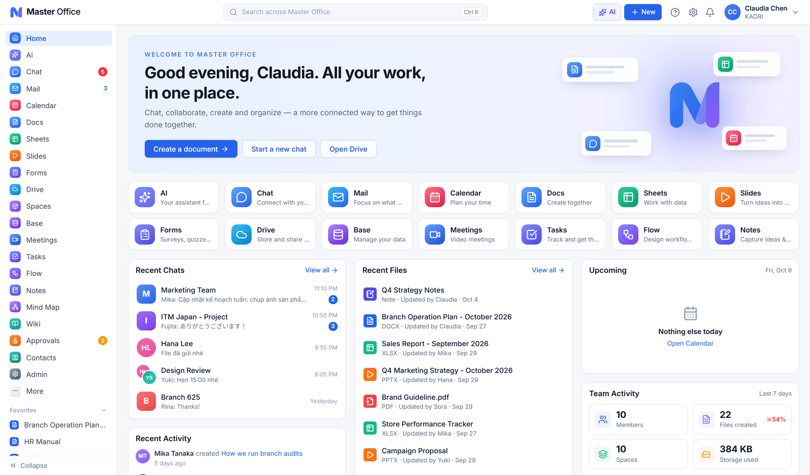 Trang chủ | 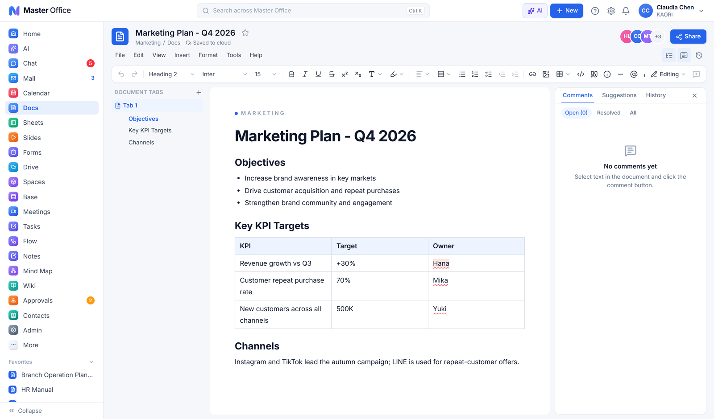 Docs |
| 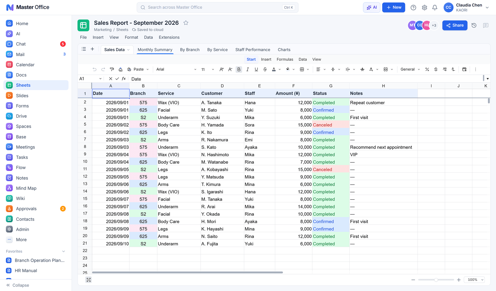 Sheets | 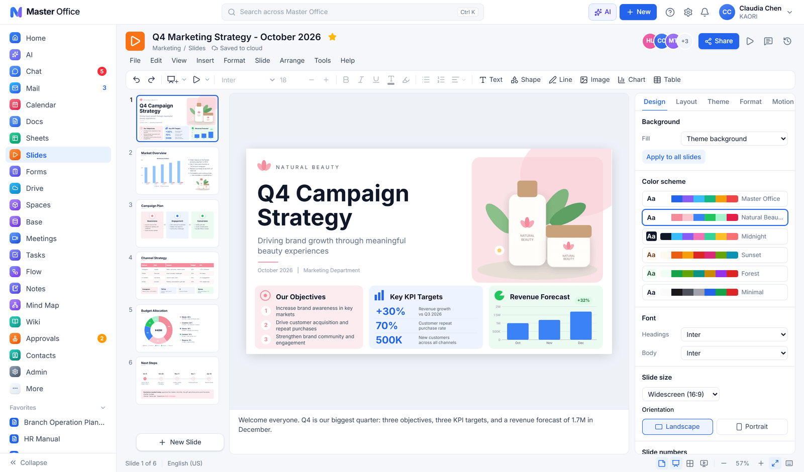 Slides |
| 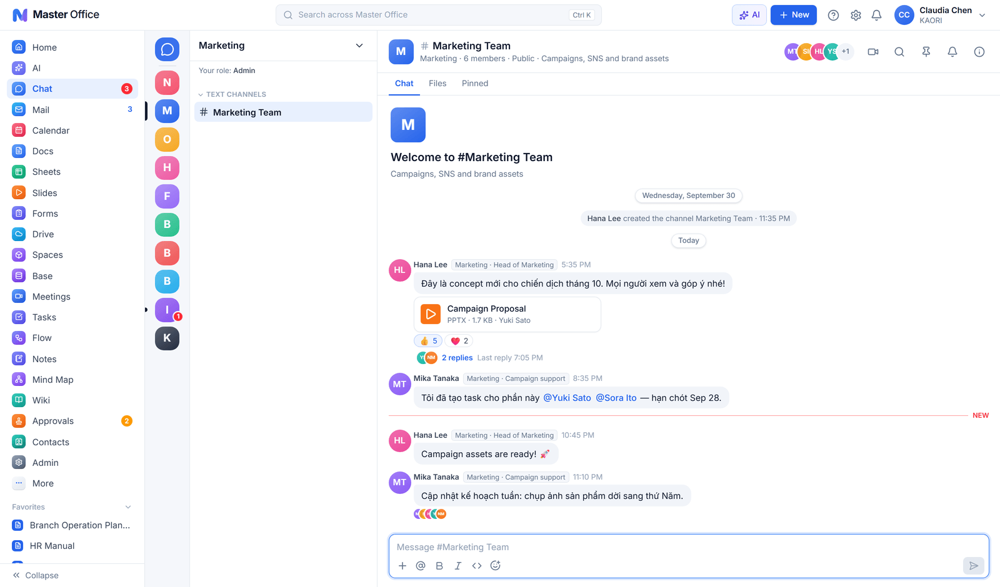 Chat | 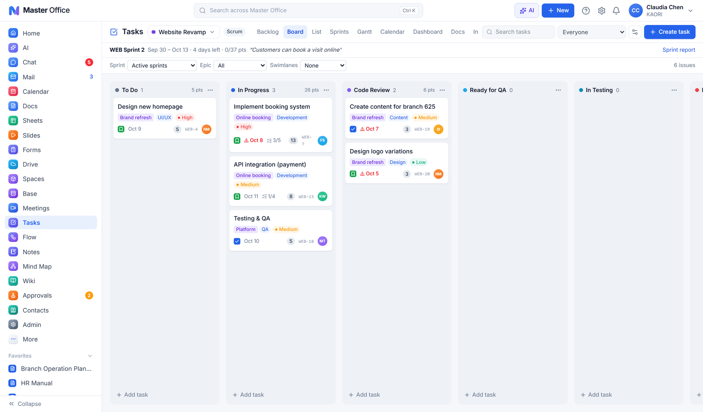 Tasks (Scrum) |
| 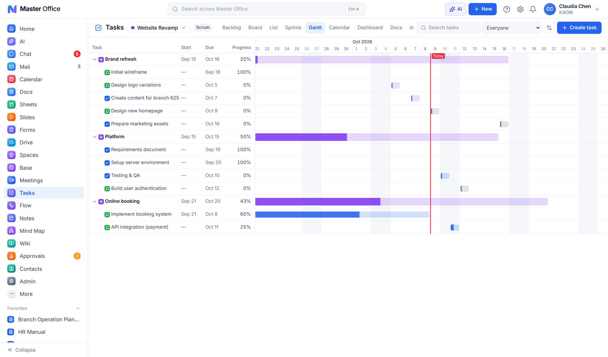 Gantt | 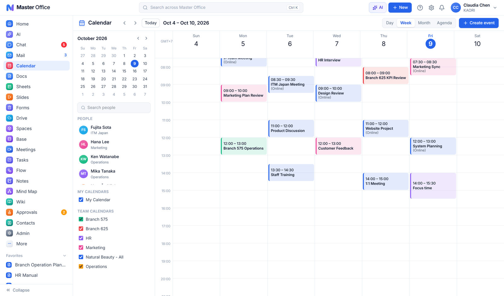 Calendar |
| 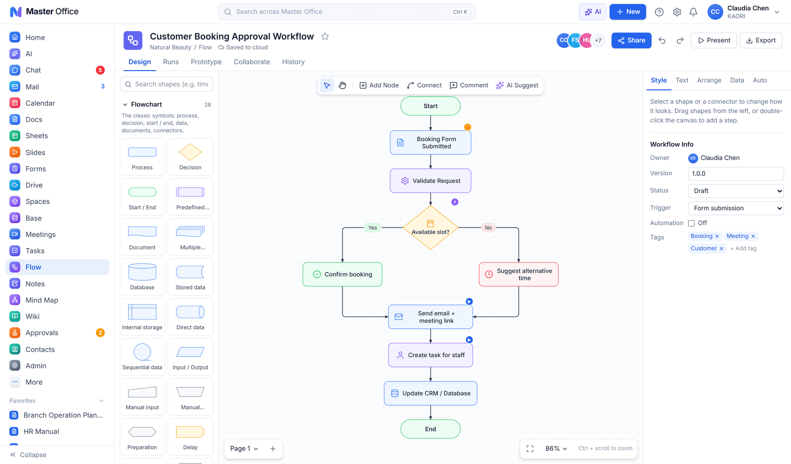 Flow | 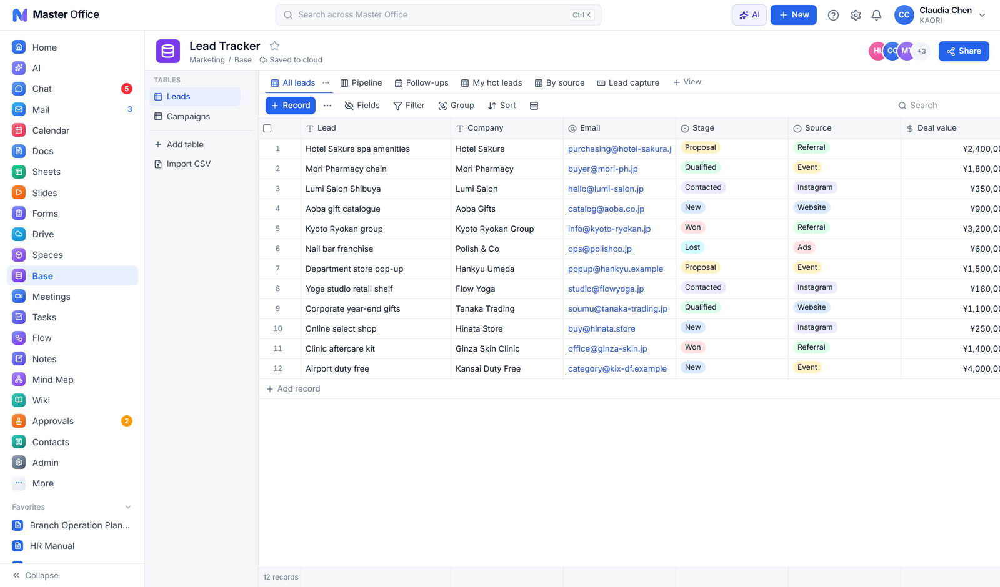 Base |
| 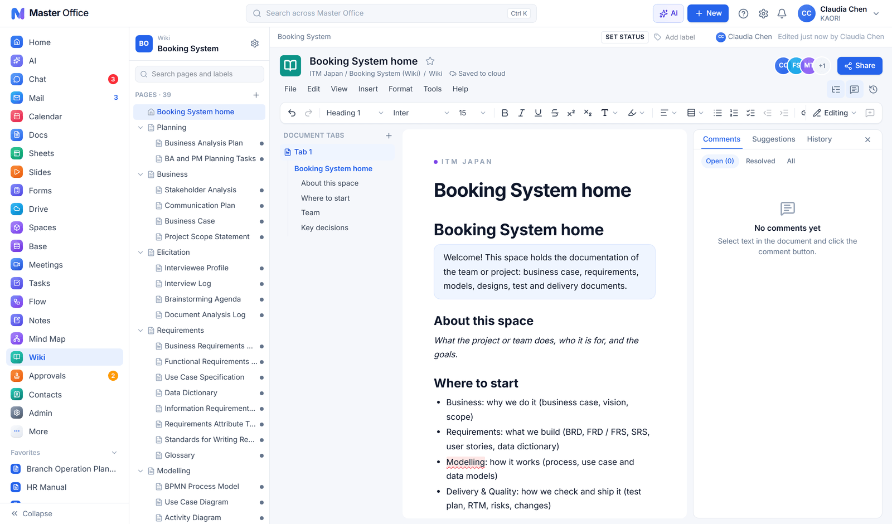 Wiki | 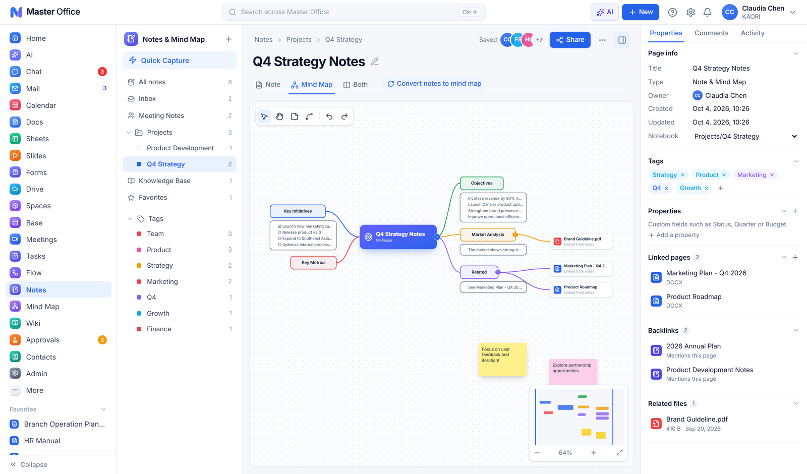 Notes & Mind Map |

Thêm: [Mail](docs/screenshots/09-mail.png) · [Forms](docs/screenshots/12-forms.png) · [Approvals](docs/screenshots/14-approvals.png) · [Drive](docs/screenshots/15-drive.png) · [AI](docs/screenshots/16-ai.png) · [Meetings](docs/screenshots/17-meetings.png) · [Spaces](docs/screenshots/18-spaces.png) · [Notes](docs/screenshots/19-notes.png)

## Có gì bên trong

| Ứng dụng | Điểm chính |
|---|---|
| **Docs** | Soạn thảo cộng tác, Word parity (mục lục, chú thích, phương trình, cột, tab, so sánh), DOCX / PDF / Markdown, kiểm tra chính tả |
| **Sheets** | Univer với công thức giống Excel (kể cả XLOOKUP, AGGREGATE), macro JavaScript + trigger, pivot, biểu đồ, bảo vệ vùng, XLSX / CSV; workbook 500k ô mở được (§83) |
| **Slides** | Layout, theme, hiệu ứng, video, trình chiếu + presenter, hỏi đáp khán giả, PPTX / PDF / PNG; AI Image Studio: ảnh từ ChatGPT / Gemini thành lớp chữ sửa được (§81) |
| **Forms** | Biểu mẫu, quiz, chấm điểm, liên kết sang Sheets, QR |
| **Drive & Spaces** | File thống nhất cho mọi ứng dụng, phiên bản, xuất bản web, dung lượng theo người / nhóm |
| **Chat & Mail** | Kênh theo Space kiểu Discord, DM, hộp thư tổ chức và hộp thư chung, SMTP vào / ra |
| **Calendar & Meetings** | Lịch cá nhân / nhóm, mời kèm .ics, họp video WebRTC, ghi hình |
| **Tasks** | Scrum / Kanban / Gantt, sprint, bug, pha và cổng, tài liệu dự án theo mẫu BA, AI-DLC |
| **Approvals, Base, Flow, Wiki** | Luồng duyệt kiểu Lark; bảng dữ liệu kiểu Airtable với form, kanban, lịch; sơ đồ BPMN / UML / ER và tự động hoá; wiki kiểu Confluence |
| **AI** | Một trợ lý trên thanh trên + trang AI: sinh workflow, workbook, deck, banner, card; kho prompt chỉnh được; Ollama local, tuỳ chọn OpenAI / Gemini cho ảnh |
| **Tổ chức** | Đăng nhập, thiết lập lần đầu, mời, phòng ban / vị trí, quyền riêng tư liên hệ, hạn mức dung lượng |

## Phát triển

Cần Node 22+, pnpm 9, Docker.

```bash
pnpm install
pnpm infra:up        # Postgres :5440, Redis :6390, S3 (SeaweedFS) :9000
pnpm db:migrate && pnpm db:seed
pnpm dev             # API :4000 (+ cộng tác :4001) + web :3000
```

Người dùng mặc định là **Claudia Chen** (chủ workspace); đổi người ở menu avatar → *Switch user (dev)*. Kiểm thử: `pnpm typecheck`, `pnpm test` (cần `pnpm dev` đang chạy). Cách đóng góp: [`CONTRIBUTING.md`](CONTRIBUTING.md).

```
apps/api        NestJS + Drizzle (Postgres) + S3 + Hocuspocus — mọi dịch vụ, một tiến trình
apps/web        Next.js 16 + Tailwind 4 + Radix + Univer + TipTap — shell và các ứng dụng
packages/*      Mô hình dữ liệu dùng chung: shared, doc-model, sheet-model, slide-model, flow-model, form-model, base-model
infra/          docker-compose (dev và production), Caddyfile
docs/           Kiến trúc, cài đặt, đối chiếu tính năng, chính sách
```

## Lưu ý

- Phát triển trên ổ exFAT: pnpm dùng `node-linker=hoisted` (xem `.npmrc`), các gói `@workos/*` được import qua path alias TypeScript.
- Một máy chủ, một tiến trình API là mục tiêu thiết kế hiện tại; giới hạn đã biết ở cuối [`docs/INSTALL.md`](docs/INSTALL.md).
